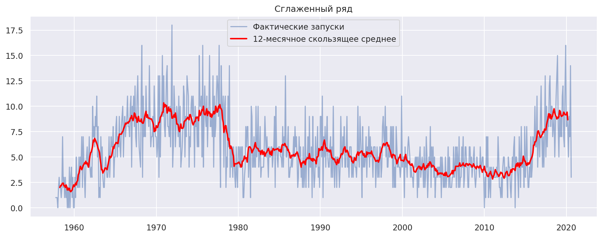
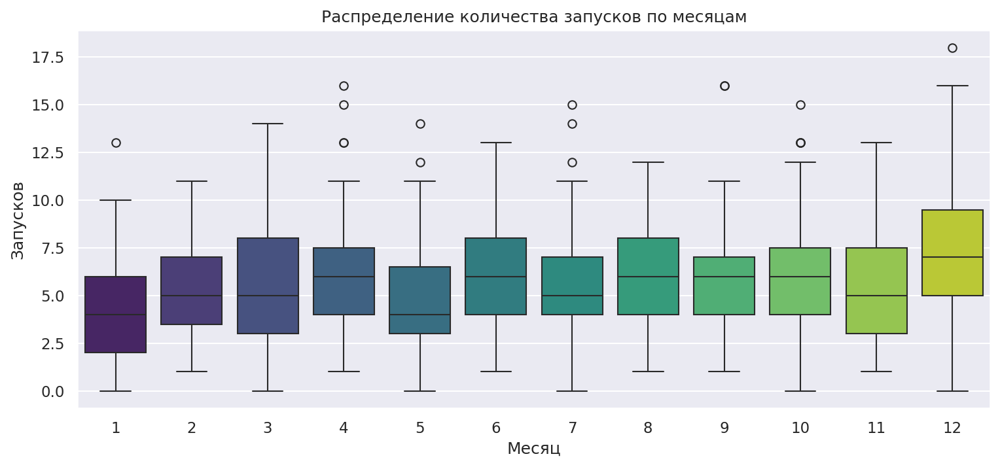
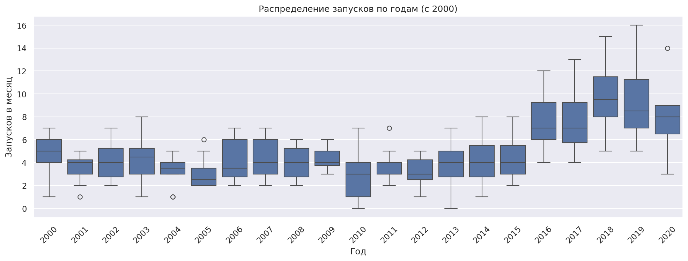
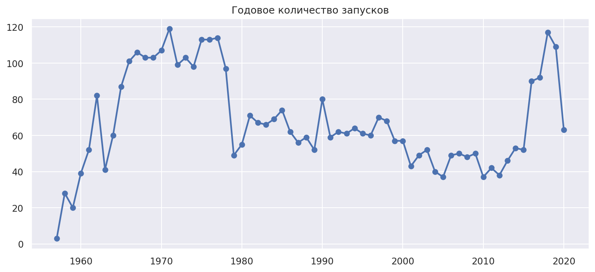
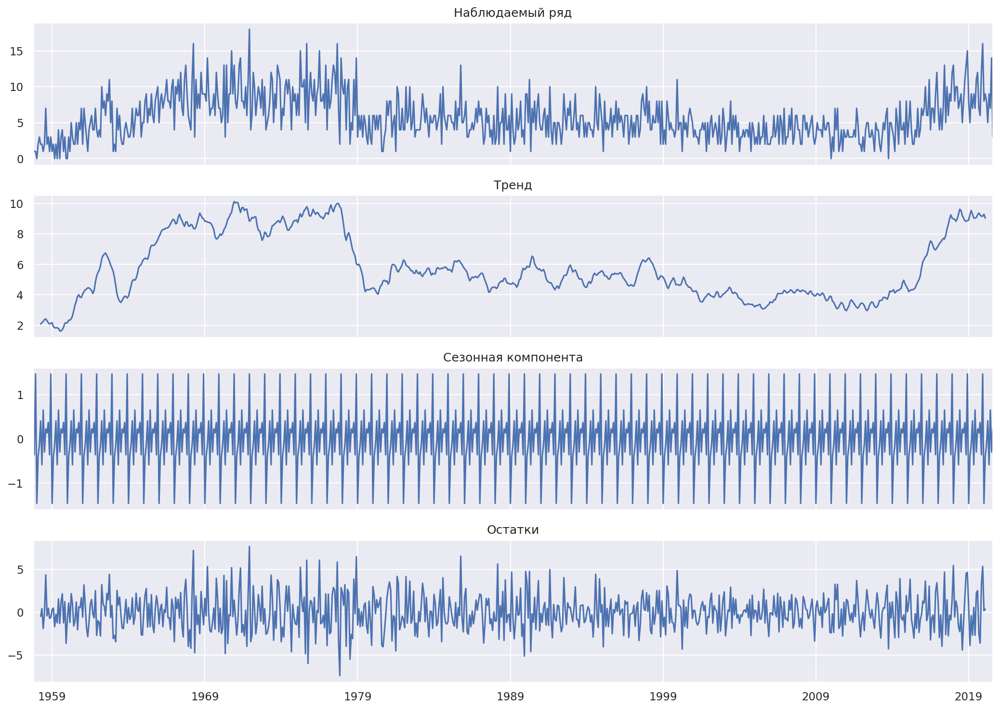
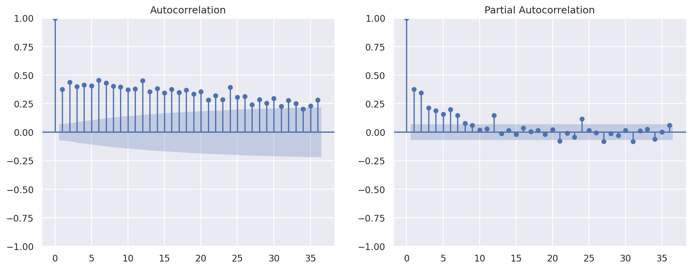
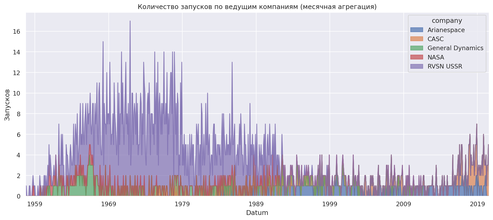
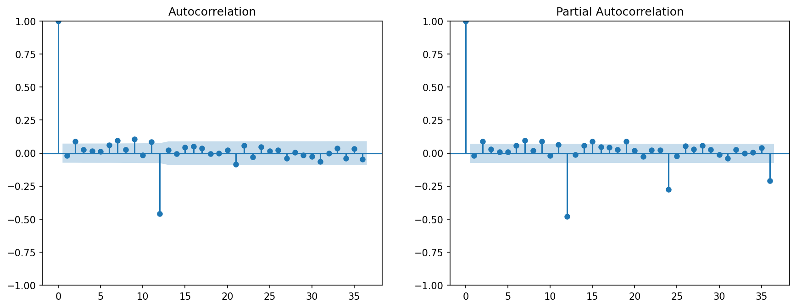
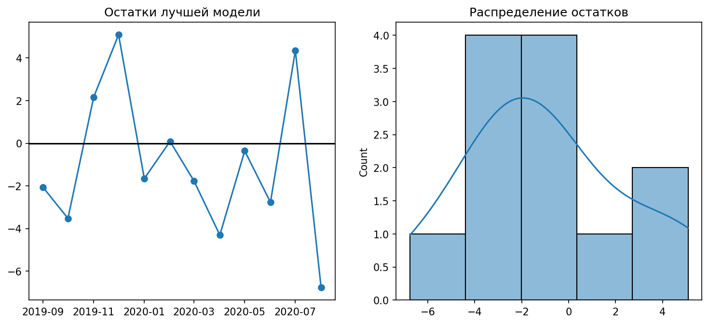
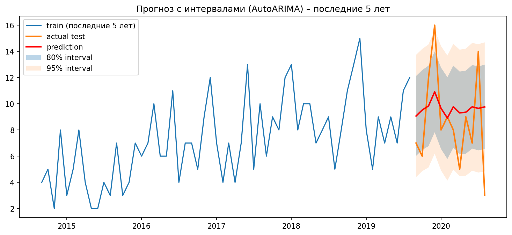

# Отчет об исследовании ВР All_Space_Missions_from_1957

## Задача №1

### 1. Описание набора данных

[датасет](https://github.com/MVRonkin/TimeSeriesCourse/blob/main/OLD%20Versions/2026/datasets/All%20Space%20Missions%20from%201957/Space_Corrected.csv) - полный перечень космических запусков с 1957 по август 2020 года (755 месяцев).
Каждая строка - одна миссия, включая компанию, дату, статус ракеты, детали, результат.

Целевая переменная - **ежемесячное количество запусков**.  

**Выводы по базовому анализу:**
- Среднее количество запусков в месяц – 5.7, медиана – 5.
- Присутствуют месяцы без запусков (8 случаев).
- Индекс монотонный, дубликатов нет, частота установлена (`MS`).

### 2. Постановка задачи

Цель: Прогнозировать будущее количество запусков в месяц (одномерный ряд)
Горизонт прогнозирования: 12 месяцев вперёд
Режим работы: Офлайн, прогноз строится на накопленных исторических данных
Тип задачи: одномерное прогнозирование временного ряда
Метрики: MAE, RMSE, sMAPE

----

### 3. Итоги EDA

- Ряд ежемесячных запусков нестационарен, содержит выраженный тренд и годовую сезонность
- Дубликатов и важных пропусков во временной структуре нет
- Задача сводится к одномерному прогнозированию, так как дополнительные факторы не включены в исходный набор данных

---------------------------------
---------------------------------
---------------------------------

## Задача №2

### Итоговое сравнение моделей и выводы

сравнили 7 методов прогнозирования месячного числа космических запусков:

- **Бейзлайн:** Naive, SeasonalNaive  
- **Ручной подбор:** SARIMA(2,0,0)(0,1,1)[12]  
- **Автоматические:** AutoARIMA, AutoETS, AutoTheta  
- **Внешний эталон:** Prophet  

#### 1. Сравнение метрик на тестовом периоде (12 месяцев)

| Модель | MAE | RMSE | sMAPE |
|--------|-----|------|-------|
| Naive | 4.33 | 4.88 | 46.3% |
| SeasonalNaive | 2.25 | 3.40 | 27.7% |
| Ручная SARIMA | 2.84  | 3.45  | 34.61% |
| AutoARIMA | 2.91 | 3.47 | 34.02% |
| AutoETS | 2.95 | 3.60 | 34.38% |
| AutoTheta | 2.97 | 3.61 | 34.69% |
| Prophet | 3.15 | 3.99 | 38.70% |

#### 2. Результаты бектестинга (кросс-валидация, 5 окон)

Средние метрики по 5 окнам:

| Модель | MAE | RMSE | sMAPE |
|--------|-----|------|-------|
| Naive | 2.77 | 3.38 | 21.3% |
| SeasonalNaive | 2.87 | 3.42 | 23.6% |
| **AutoARIMA** | **2.21** | **2.82** | **16.7%** |
| AutoETS | 2.24 | 2.78 | 16.7% |
| AutoTheta | 2.21 | 2.77 | 16.5% |

#### 3. Качественный анализ

**Наивные модели:**  
SeasonalNaive лучше обычного Naive благодаря учёту годовой сезонности

**Ручная SARIMA(2,0,0)(0,1,1)[12]:**  
Параметры модели обоснованы ADF-тестами и анализом ACF/PACF. Качество прогноза практически совпало с автоматическими аналогами, что подтверждает правильность ручного анализа.

**Автоматические модели (AutoARIMA, AutoETS, AutoTheta):**  
Все три модели показали близкие результаты. AutoARIMA чуть лучше по MAE на тесте (2.91), AutoTheta — минимальный RMSE в бектестинге (2.77).

**Prophet:**  
Модель корректно описала годовую сезонность и тренд, но дала наибольшие ошибки на тесте (MAE 3.15, sMAPE 38.7%). Возможная причина - относительно короткая история для автоматического выделения сложных сезонных паттернов либо переобучение на обучающем периоде. В текущей постановке Prophet не дал преимуществ перед классическими статистическими моделями.

#### 4. Диагностика лучшей модели (AutoARIMA)

**Анализ остатков на тестовом периоде:**  
- График остатков не показывает систематических паттернов
- Гистограмма остатков близка к симметричной, что говорит об отсутствии систематического смещения
- Тест Льюнга–Бокса (лаги 1–6): все p‑значения > 0.05 (0.33–0.93) → нулевая гипотеза об отсутствии автокорреляции не отвергается

**Вероятностный прогноз:**  
- Точечный прогноз обладает крайне низкой вариабельностью
- Прогнозные интервалы (80% и 95%) оказались **широкими**, но при этом **фактические точки тестового периода регулярно выходили за их пределы**.  
- Это говорит о **недооценке неопределённости моделью**: истинная волатильность числа запусков выше, чем предполагает модель с нормально распределёнными ошибками.  
- Низкая вариабельность точечного прогноза и широкие интервалы создают ложное впечатление надёжности - фактически интервалы плохо калиброваны и не могут использоваться для оценки рисков без доработки.

#### 5. Итоговая рекомендация

AutoARIMA может служить **хорошим базовым прогнозом среднего уровня запусков** (MAE ~2.2 в бектестинге), но **вероятностные оценки требуют осторожности** из-за неадекватной калибровки интервалов на тестовом периоде.

В текущем виде модель можно применять для **точечного прогнозирования с пониманием, что фактические значения могут значительно отклоняться от предсказаний**, а интервалы служат лишь ориентиром минимальной неопределённости. Для ответственных решений необходима доработка вероятностной части.

---------------------------------
---------------------------------
---------------------------------

## Задача №3

